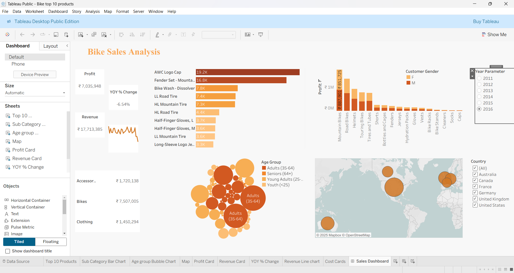

🚴 Bike Top 10 Products Dashboard

This repository contains the source files for a Power BI dashboard that visualizes the top 10 bike products based on sales.
The dashboard is designed to provide insights into product performance, helping users identify best-sellers and analyze sales trends.

📷 Dashboard Screenshot

🚀 Features

Interactive Visualizations: Explore bike product sales through charts and graphs.

Top 10 Products Analysis: Track sales performance of the best-selling bike products.

Dynamic Filtering: Easily filter data by product category, time period, or region.

Sales Insights: Identify trends and patterns in customer preferences.

📦 Files in This Repository

Bike Top 10 Products.pbix → The main Power BI Desktop file (data model, queries, reports, visualizations).

Bike Sales Data.xlsx → The Excel dataset used in the dashboard.

bike_dashboard.png → Screenshot of the dashboard.

LICENSE → Project license file.

README.md → Documentation for the repository.
